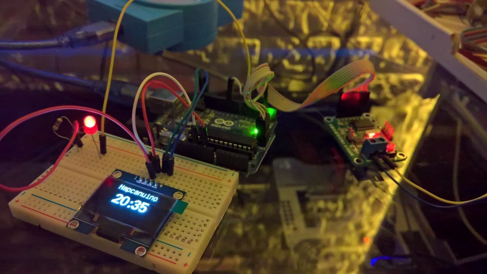

# Hapcanuino
Hapcanuino is a library that simplifies creation of Arduino based module for [Hapcan](http://hapcan.com/) Home Automation Project.
Hapcan uses CAN bus to communicate between modules which are made with PIC microcontrollers. Hapcanuino brings to Arduino (and AVR) users ability to easily creating Hapcan compatible modules.

**Note this project is currently in early developing phase.**

##Hardware requirements
- Arduino (currently only Arduino UNO R3 was tested)
- MCP2515 CAN Controller board (tested), or CAN Shield for Arduino.
- Hapcan modules instalation
- Propably an USB galvanic isolator for programming Arduino with active connection to Hapcan bus (I'm using YN Tech USB-4620 for safety)

##Software requirements
- [Hapcan Programmer](http://hapcan.com/software/hap/)
- [MCP_CAN](https://github.com/coryjfowler/MCP_CAN_lib) library for Arduino
- Library is writing in Visual Studio with Visual Micro addon, so no highlighting for Arduino Sketch editor is available now

##Addidional Help
Go to [Wiki](https://github.com/Onixarts/Hapcanuino/wiki) for get more help.
